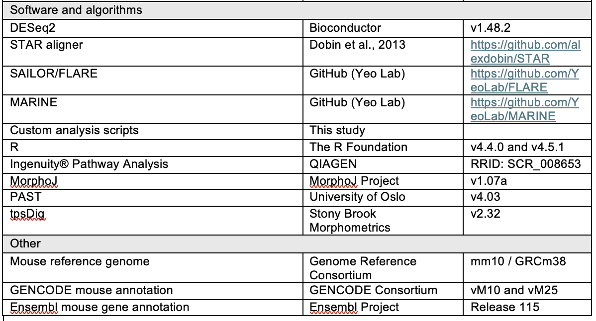

# Physiologic variation in sperm miRNAs tune embryonic gene regulatory programs and developmental outcomes

Small RNAs delivered by sperm can transmit environmentally regulated, epigenetically inherited phenotypes to offspring, yet the mechanisms by which modest changes in sperm microRNA (miRNA) abundance overcome dilution within the much larger egg to influence embryonic development remain unresolved. Here, we show that physiologically relevant variation in individual sperm miRNAs is sufficient to quantitatively program embryonic gene expression and developmental outcomes. Using parthenogenetic and fertilized embryos, we show that as few as 200 molecules of miR-200c-3p or miR-465c-3p induces reproducible, dose-dependent gene expression responses that are restricted to defined developmental windows. Parthenogenetic embryos faithfully recapitulate early miRNA-driven gene expression changes observed in fertilized embryos, validating their use for isolating early regulatory mechanisms. We further developed AGO2-REMORA, an RNA adenosine base editor fused to Argonaute2 to map miRNA–mRNA interactions in embryos, revealing that early mRNA repression reflects direct miRNA targeting, while transcriptional changes at later stages arise as secondary consequences of these initial interactions. Furthermore, we show that modest elevation of miR-200c-3p during early development is sufficient to induce transcriptional alterations through early development and produce craniofacial phenotypes in late-stage embryos, recapitulating features of fetal alcohol syndrome associated with paternal alcohol consumption. Together, these findings establish a generalizable framework by which small perturbations in sperm miRNA content quantitatively modulate early gene regulatory programs, triggering cascades that persist throughout development and influence offspring phenotype.

Keywords: epigenetic inheritance, miRNA, sperm, embryonic development, alcohol

### Experimental Design

Here, we propose a cascade model in which sperm miRNAs transiently act directly in the early embryo, downregulating targets through canonical base-pairing interactions. Repression of these early targets trigger indirect, downstream changes that alter developmental trajectories, thereby leading to persistent phenotypic outcomes. In this study, we test this model by quantitatively elucidating how specific miRNAs influence zygotic and early embryonic development. To do this, we microinjected defined quantities of miR-200c-3p and/or miR-465c-3p into zygotes and profiled gene expression at the late 2-cell, 4-cell, and morula stages in parthenogenetic and sperm-fertilized embryos to determine how physiologic variation in sperm miRNAs quantitatively alters embryonic gene expression programs. To distinguish direct miRNA targeting from downstream regulatory effects, we further adapt REMORA (RNA-encoded molecular record of RNA-protein interactions) by coupling it to Argonaute2 for use in preimplantation embryos, enabling identification of miRNA target engagement in 2-cell parthenogenetic embryos to define immediate molecular responses and direct targets of sperm miRNAs following fertilization. Finally, we demonstrate that delivery of as few as 200 molecules, a dose within the endogenous range delivered by sperm, of a single sperm miRNA, miR-200c-3p, is sufficient to induce craniofacial defects in offspring, establishing direct causality between sperm miRNA perturbation and alcohol-associated developmental phenotypes.

### Code Availability

This repository will contain all associated scripts to replicate the analyses provided in the manuscript. Individual scripts are contained in the scripts subfolder. 

### Public Data

Data is available through the NCBI GEO portal, accession number GSE255282 (https://www.ncbi.nlm.nih.gov/geo/query/acc.cgi?acc=GSE255282). Data is uploaded as the fastq files and the processed count matrices for each library. 

 
